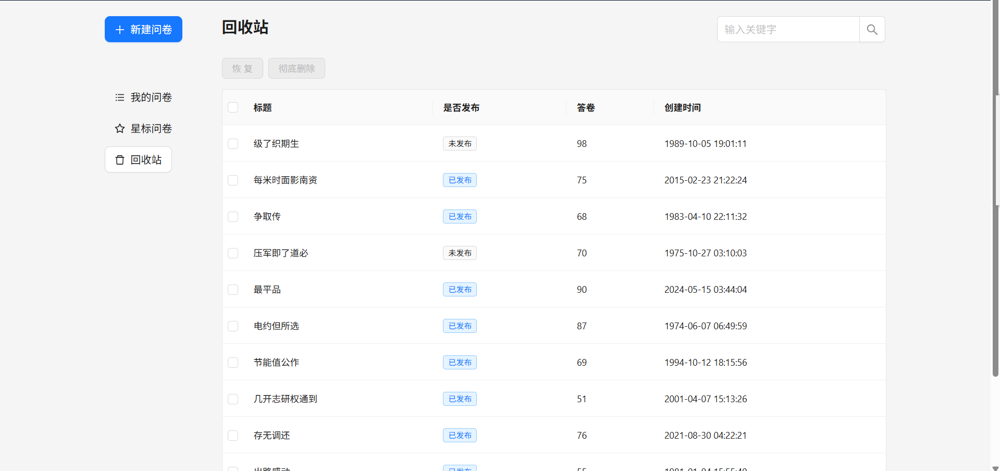
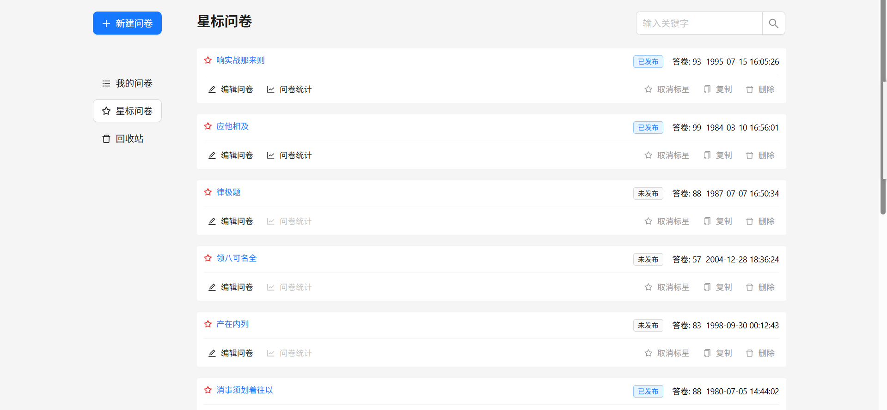
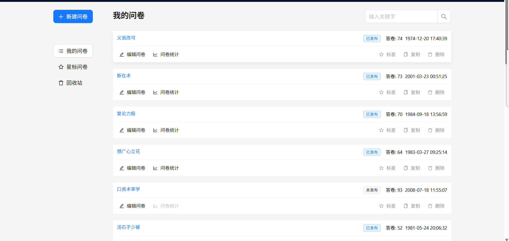
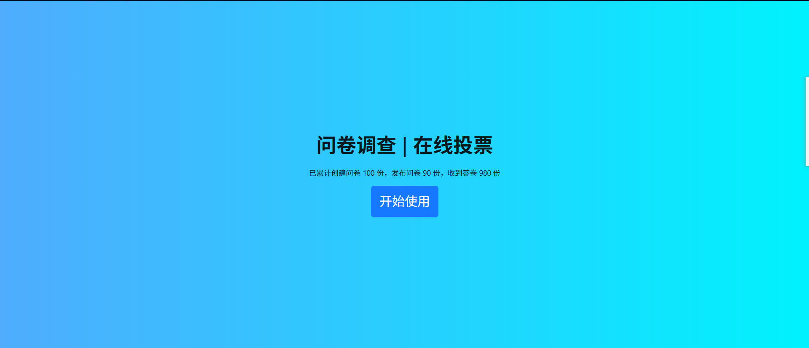

# React 低代码问卷平台

本项目为基于 React+ts 技术栈的仿问卷星低代码平台，包含前端页面、组件库、问卷编辑与统计等功能，适合学习和参考现代 React 项目架构与开发实践。

## 目录结构简介

- `wenjuan-fe/`：主前端项目，包含问卷编辑、填写、统计等页面。
- `wenjuan-mock/`：本地 mock 后端，模拟接口数据。
- 其它 demo 目录：包含 Redux、MobX、dnd-kit 等技术的独立示例。
- `assets/`：项目相关图片与视频素材。

---

## 项目演示图片

