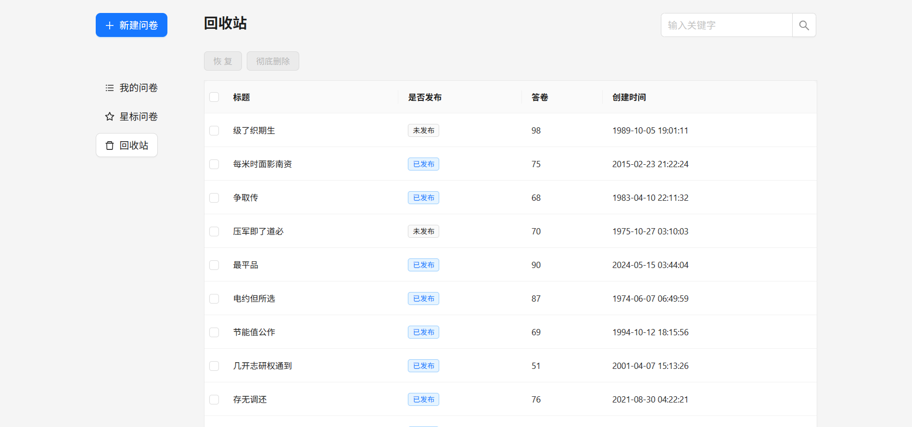

# React 低代码问卷平台

本项目是一个基于 React + TypeScript 技术栈的高质量低代码问卷平台，致力于实现“所见即所得”的问卷编辑体验，具备高度组件化、强大属性面板、灵活状态管理和丰富交互能力。项目适合学习现代前端架构、组件解耦、属性双向绑定、Undo/Redo、数据导出等核心技术。

## 项目亮点与技术优势

- **高度组件化设计**：所有问卷元素（如单选、多选、填空、标题等）均采用独立组件开发，支持灵活组合与复用，便于扩展和维护。
- **属性面板与双向绑定**：每个组件均配备属性面板，支持实时编辑属性（如标题、选项、校验规则等），实现属性与视图的双向同步，极大提升用户体验。
- **拖拽排序与布局**：支持问卷组件的拖拽排序、分组、层级调整，交互流畅，体验媲美主流低代码平台。
- **全局状态管理与 Undo/Redo**：采用全局状态管理方案，支持问卷编辑的撤销/重做、历史记录，保障用户操作的可控性和安全性。
- **数据导出与持久化**：支持问卷结构与答卷数据的导出、导入，便于数据迁移和二次开发。
- **响应式与可扩展架构**：项目架构清晰，支持响应式布局，便于后续接入更多题型或功能模块。
- **丰富的交互体验**：支持组件拖拽、属性实时编辑、问卷预览、答题统计等多种交互场景，满足实际业务需求。
- **工程化与规范化**：采用 TypeScript 全面类型约束，代码风格统一，易于团队协作和二次开发。
- **Mock 数据与本地开发友好**：内置 mock 服务，前后端可独立开发，极大提升开发效率。
- **易于扩展和二次开发**：无论是新增题型、定制属性，还是对接第三方服务，均有清晰的扩展点和接口文档。

## 主要功能模块

- 问卷编辑器：所见即所得的可视化编辑，支持多种题型的增删改查与排序
- 组件库：内置丰富的问卷组件，支持自定义扩展
- 属性面板：实时配置组件属性，支持校验、联动等高级功能
- 拖拽排序：支持组件的自由拖拽与分组，提升编辑效率
- 状态管理：全局状态同步，支持撤销/重做、历史记录
- 数据导出/导入：支持问卷结构与答卷数据的导出、导入与持久化
- 统计分析：支持答卷数据的可视化统计与导出
- 响应式布局：适配多终端访问，体验一致

## 项目适用场景

- 企业/学校/机构的问卷调查、表单收集、在线考试等场景
- 低代码平台、表单引擎、可视化编辑器等前端项目的参考与二次开发
- 前端工程师学习组件化、状态管理、属性面板、Undo/Redo、数据导出等核心技术的实战案例

## 目录结构简介

- `wenjuan-fe/`：主前端项目，包含问卷编辑、填写、统计等页面。
- `wenjuan-mock/`：本地 mock 后端，模拟接口数据。
- 其它 demo 目录：包含 Redux、MobX、dnd-kit 等技术的独立示例。
- `assets/`：项目相关图片与视频素材。

---

## 项目演示图片

